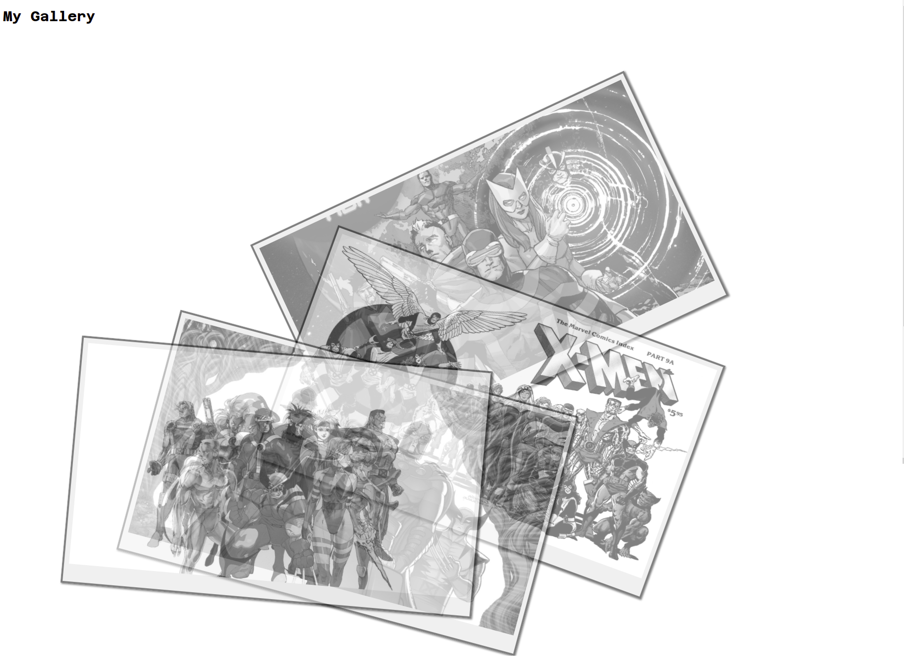

# My Gallery

**[Test this app yourself](https://vincenzoarena.github.io/galleryTryout/)**

---

#### Navigation

- About Project
  - _Description_
  - _Developed With_
- How to use this Project
  - _Description_
  - _Developed With_
- Contact
  - _Mail_
  - _GitHub_
  - _LinkedIn_
- Used Tools
  - _Fonts_
  - _Design_
  - _Icons_
  - _Colors_

---

### About Project

This is my first try at building a photo gallery using HTML and CSS.
Using some images from my favorite comics, the X-MEN by MARVEL COMICS and a font from Google Fonts.
I worked on transparency, positioning and hover effect to animate the polaroid-like images.

### How to use this Project

Hovering over the semi-transparent gray images, they move in a straight position and get top 100% opacity and color.

##### Developed With

- [x] _HTML5_
- [x] _CSS3_
- [ ] _SASS_
- [ ] _SCSS_
- [ ] _JavaScript_
- [ ] _React_
- [ ] _Bootstrap_
- [ ] _npm_
- [x] _Markdown_

---

### Contact

Mail: <penninoematita@gmail.com> 
GitHub: [vincenzoarena](https://github.com/vincenzoarena) 
LinkedIn: [Vincenzo Arena](https://www.linkedin.com/in/vincenzo-arena-032a064b/)

---

### Used Tools

- [The copyright of all the images is owned by MARVEL COMICS](https://www.marve.com)
- [Google Fonts](https://fonts.google.com/)
- [Visual Studio Code](https://code.visualstudio.com/)
